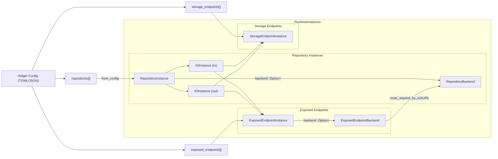
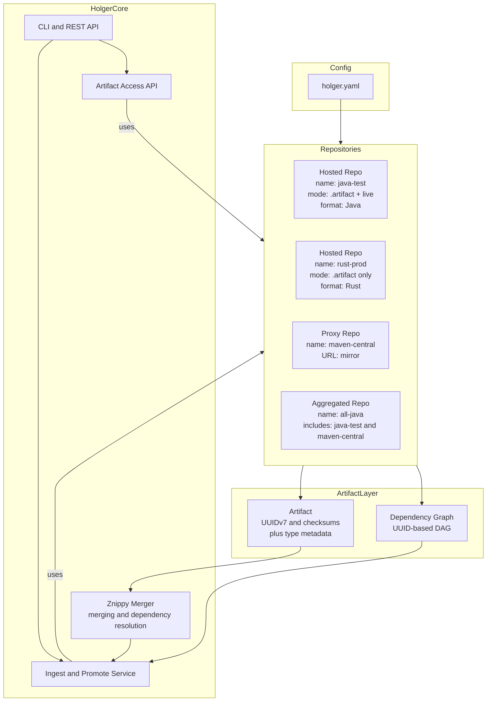

# Holger

**Holger guards your artifacts at rest.**

-->NOTE Holger projekt just started , come back later <--


Immutable Rust-based artifact airgaper. Holger ingests language-specific package trees and serves them over standardized APIs, just like Artifactory or Nexus — but with an airgapped, append-only backend called **artifact**, based on Znippy archives.  


## Overview

When airgapping environments, your company saves offline packages using native language tools. These packages are exported and organized under the following structure:

```text
/airgap/
  rust/     <- cargo vendor
  python/   <- pip download
  java/     <- mvn dependency:go-offline
  go/       <- TBD
```

These folders are archived into a `.znippy` file by the Znippy CLI. The resulting `.znippy` file is immutable and can be verified using Blake3 checksums.

The Holger service reads this `.znippy` archive and exposes one virtual API endpoint per language. Internally, the `.znippy` file is parsed into one Arrow-based table per language, collectively called an `.artifact` file. Holger uses this file to respond to requests from tools like Cargo, pip, Maven and Go.

## Holger Serving Modes

All `.artifact` files are immutable. However, Holger can optionally be configured to allow **live ingest** of artifacts not found in the current `.artifact`. This is primarily useful in DEV environments.

| History | Source                   | Update Capability         | Use Case                           |
| ---- | ------------------------ | ------------------------- | ---------------------------------- |
| V1   | Initial .artifact import  | Immutable                 | Bootstrap, base snapshot           |
| V2   | .artifact + live ingest   | Yes (in-memory + RocksDB) | DEV: allow dynamic additions       |
| V3   | Promoted `.artifact` only | Immutable                 | PROD: strict airgapped enforcement |

- V2 allows development-time fetches from upstream sources (e.g. crates.io, PyPI) and caches them.
- V3 is the result of promoting selected artifacts from V2 into a new `.artifact` file.
- Live proxy mode can be disabled completely in strict environments.

## Architecture
Newest on top , older if you scroll down.





## Status

- ✅ Znippy archive ingestion
- ✅ Arrow-based indexing
- ✅ Immutable .artifact output
- ⛖ API servers in progress
- 🚽 Blake3 verification in place
- 

## Mindmapping ..


Exampe config for small deploy.
```toml
[[exposed_endpoints]]
name = "prod"
url_prefix = "https://10.101.1.9:8443"
cert = "holger-core/tests/cert.pem"
key = "holger-core/tests/key.pem"

[[storage_endpoints]]
name = "artifact-prod"
type = "znippy"
path = "/var/lib/holger/rust-prod/"

[[repositories]]
name = "rust-prod"
type = "rust"
out = { storage_backend = "artifact-prod", exposed_endpoint = "prod" }
```

