```mermaid
flowchart LR

%% Step 1: Airgap dump
subgraph Offline_Airgap_Dump
    RUST["rust/ (cargo vendor)"]
    PYTHON["python/ (pip download)"]
    JAVA["java/ (mvn go-offline)"]
    GO["golang/ (TBD)"]
end

RUST --> ZNIPPY["📦 Znippy Archive"]
PYTHON --> ZNIPPY
JAVA --> ZNIPPY
GO --> ZNIPPY

%% Step 2: Holger Ingestion
ZNIPPY --> HOLGER["🛡 Holger Service"]

%% Artisan Format Output
HOLGER --> ARTISAN["📚 .artisan (Immutable Archive)"]

%% Step 3: Holger Serving via APIs
subgraph Holger_API_Endpoints
    CARGO["Cargo Git+HTTP"]
    PIP["PyPI Simple API"]
    MAVEN["Maven Repo API"]
    GOPROXY["Golang Proxy Mode"]
end

ARTISAN --> CARGO
ARTISAN --> PIP
ARTISAN --> MAVEN
ARTISAN --> GOPROXY
```

# Holger

**Holger guards your artifacts at rest.**

Immutable Rust-based artifact airgaper. Holger ingests language-specific package trees and serves them over standardized APIs, just like Artifactory or Nexus — but with an airgapped, append-only backend called **Artisan** based on Znippy archives.

## Overview

When airgapping environments, your company saves offline packages using native language tools. These packages are exported and organized under the following structure:

```text
/airgap/
  rust/     <- cargo vendor
  python/   <- pip download
  java/     <- mvn dependency:go-offline
  go/       <- TBD
```

These folders are archived into a `.znippy` file by the Znippy CLI. The resulting `.znippy` file is immutable and can be verified using Blake3 checksums.

The Holger service reads this `.znippy` archive and exposes one virtual API endpoint per language. Internally, the `.znippy` file is parsed into one Arrow-based table per language, collectively called an `.artisan` file. Holger uses this file to respond to requests from tools like Cargo, pip, Maven and Go.

## Architecture



## Status

- ✅ Znippy archive ingestion
- ✅ Arrow-based indexing
- ✅ Immutable .artisan output
- 🔧 API servers in progress
- 🛡 Blake3 verification in place

