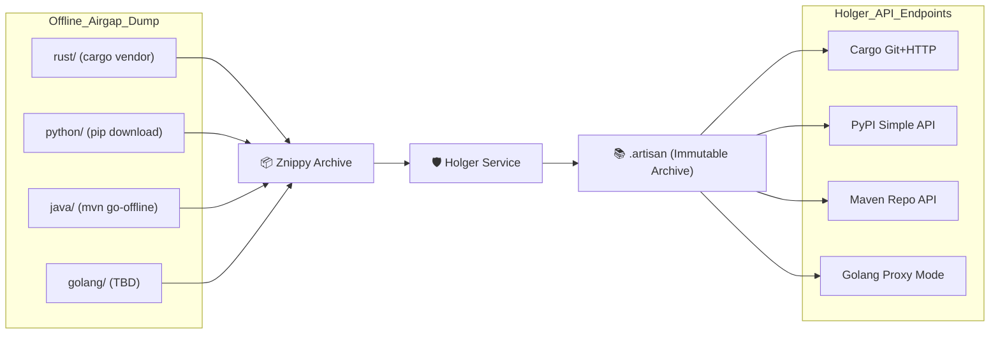

# Holger guards your airgapped artifacts at rest.
Holger is Rust-native service exposing immutable artifacts per-language type registry APIs

```mermaid
flowchart LR

%% Step 1: Airgap dump
subgraph Offline_Airgap_Dump
    RUST["rust/ (cargo vendor)"]
    PYTHON["python/ (pip download)"]
    JAVA["java/ (mvn go-offline)"]
    GO["golang/ (TBD)"]
end

RUST --> ZNIPPY["📦 Znippy Archive"]
PYTHON --> ZNIPPY
JAVA --> ZNIPPY
GO --> ZNIPPY

%% Step 2: Holger Ingestion
ZNIPPY --> HOLGER["🛡 Holger Service"]

%% Artisan Format Output
HOLGER --> ARTISAN["📚 .artisan (Immutable Archive)"]

%% Step 3: Holger Serving via APIs
subgraph Holger_API_Endpoints
    CARGO["Cargo Git+HTTP"]
    PIP["PyPI Simple API"]
    MAVEN["Maven Repo API"]
    GOPROXY["Golang Proxy Mode"]
end

ARTISAN --> CARGO
ARTISAN --> PIP
ARTISAN --> MAVEN
ARTISAN --> GOPROXY
```
